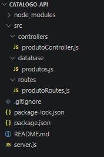
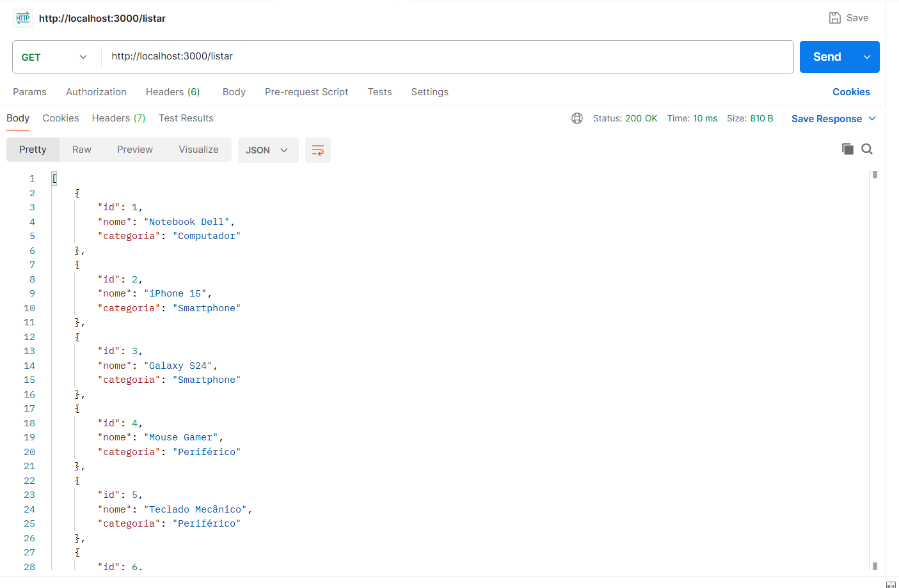
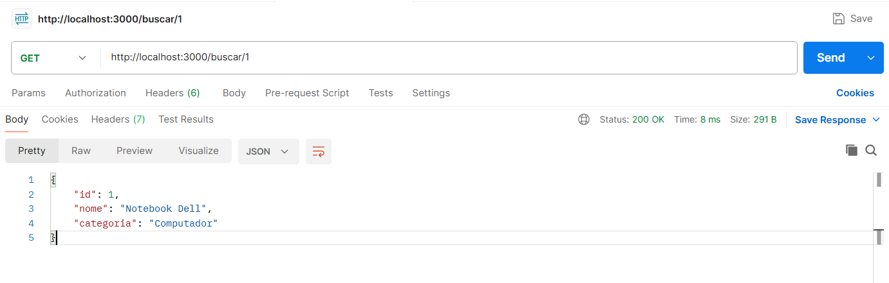
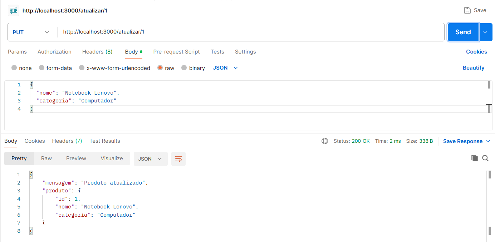
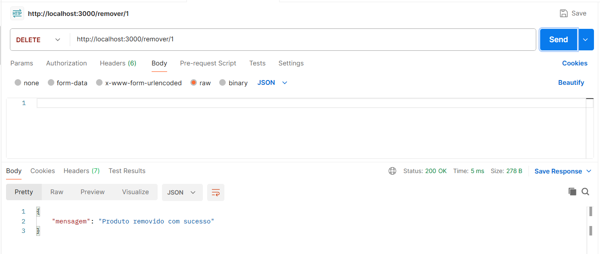

# 💻 Catálogo de Produtos Tecnológicos API

## 📖 Sobre o Projeto

Esta API REST foi desenvolvida utilizando Node.js e Express com o objetivo de simular um catálogo de produtos tecnológicos.

O projeto segue uma estrutura organizada com separação entre rotas, controllers e base de dados simulada, permitindo realizar operações de cadastro, consulta, atualização e remoção de produtos.

---

## 🎯 Tema Escolhido

**Produtos Tecnológicos**

---

## 👥 Integrantes

* Trícia Britto

---

## 🛠️ Tecnologias Utilizadas

* Node.js
* Express.js
* JavaScript
* Postman
* Git
* GitHub

---

## 📁 Estrutura do Projeto

```text
catalogo-api/
│
├── src/
│   ├── controllers/
│   │   └── produtoController.js
│   │
│   ├── routes/
│   │   └── produtoRoutes.js
│   │
│   └── database/
│       └── produtos.js
│
├── prints/
│   ├── estrutura.png
│   ├── postman-get.png
│   ├── postman-get-id.png
│   ├── postman-post.png
│   ├── postman-put.png
│   └── postman-delete.png
│
├── server.js
├── package.json
├── package-lock.json
├── .gitignore
└── README.md
```

---

## 🚀 Como Executar o Projeto

### 1️⃣ Clonar o repositório

```bash
git clone https://github.com/tricibritto/catalogo-produtos-api.git
```

### 2️⃣ Acessar a pasta do projeto

```bash
cd catalogo-api
```

### 3️⃣ Instalar as dependências

```bash
npm install
```

### 4️⃣ Executar o servidor

```bash
node server.js
```

### 5️⃣ Acessar a API

```http
http://localhost:3000
```

---

## 📦 Base de Dados Simulada

A aplicação utiliza uma base de dados simulada contendo 10 produtos tecnológicos.

Exemplo:

```javascript
{
  id: 1,
  nome: "Notebook Dell",
  categoria: "Computador"
}
```

---

# 🔗 Endpoints

## 📋 Listar Produtos

### Método

```http
GET /listar
```

### Exemplo

```http
http://localhost:3000/listar
```

---

## 🔍 Buscar Produto por ID

### Método

```http
GET /buscar/:id
```

### Exemplo

```http
http://localhost:3000/buscar/1
```

---

## ➕ Cadastrar Produto

### Método

```http
POST /cadastrar
```

### Exemplo de Body

```json
{
  "nome": "Tablet Samsung",
  "categoria": "Tablet"
}
```

---

## ✏️ Atualizar Produto

### Método

```http
PUT /atualizar/:id
```

### Exemplo de Body

```json
{
  "nome": "Notebook Lenovo",
  "categoria": "Computador"
}
```

---

## 🗑️ Remover Produto

### Método

```http
DELETE /remover/:id
```

---

## 🧪 Evidências dos Testes

### 📁 Estrutura do Projeto

```


```

---

### 📋 GET - Listar Produtos

```


```

---

### 🔍 GET - Buscar Produto por ID

```


```

---

### ➕ POST - Cadastrar Produto

```


```

---

### ✏️ PUT - Atualizar Produto

```


```

---

### 🗑️ DELETE - Remover Produto

```


```

---

Todos os endpoints foram testados com sucesso utilizando o Postman.

## ✅ Funcionalidades

* Listar produtos
* Buscar produto por ID
* Cadastrar novos produtos
* Atualizar produtos existentes
* Remover produtos
* Retornar dados em formato JSON
* Organização em rotas e controllers

---

## 📚 Disciplina

Desenvolvimento de APIs

---

## 🎓 Instituição

SENAI

---

## 📌 Objetivo da Atividade

Desenvolver uma API REST organizada utilizando Node.js e Express, aplicando conceitos de rotas, controllers, manipulação de dados em memória, testes com Postman e versionamento com Git e GitHub.

---

## 👩‍💻 Autora

**Trícia Britto**
